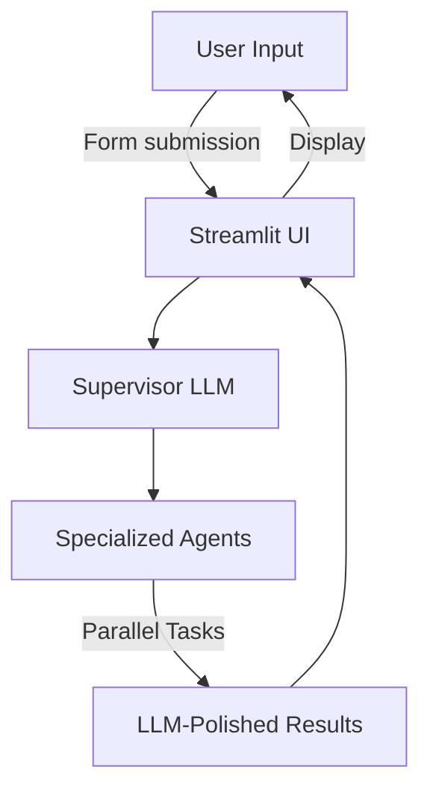
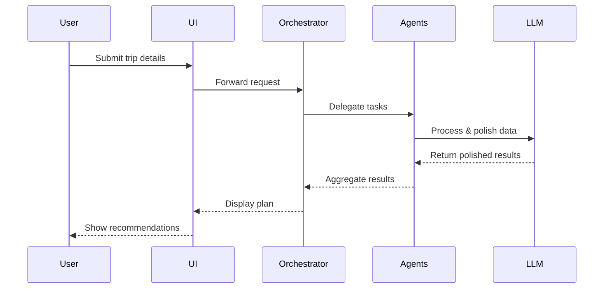
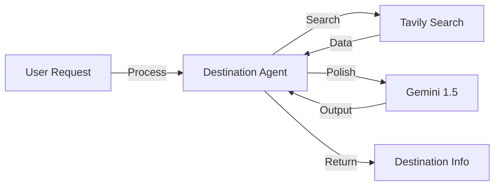
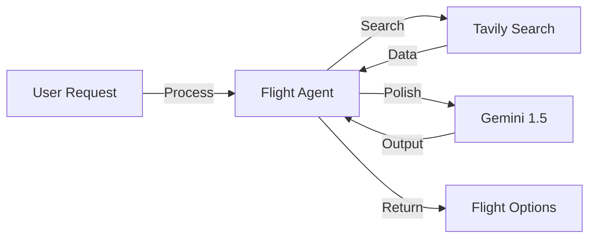
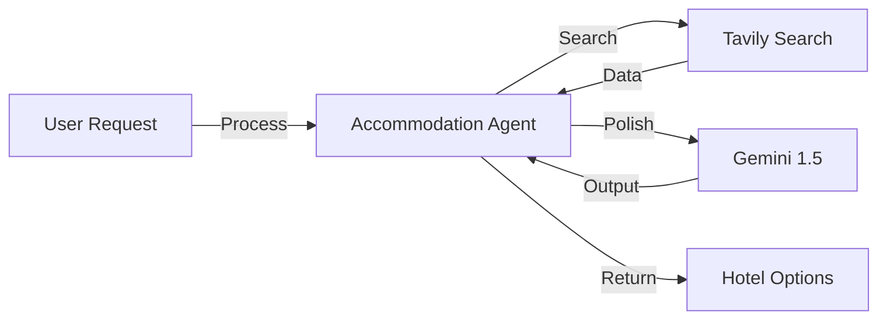
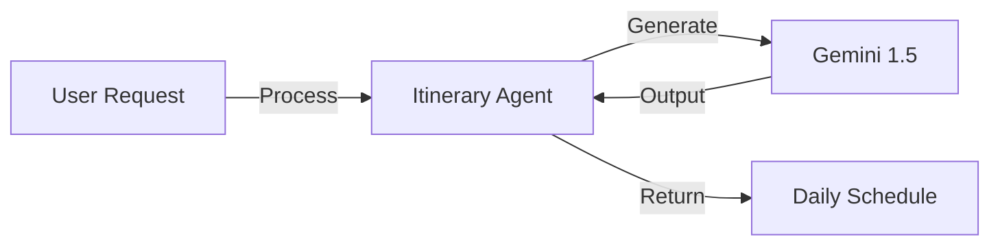
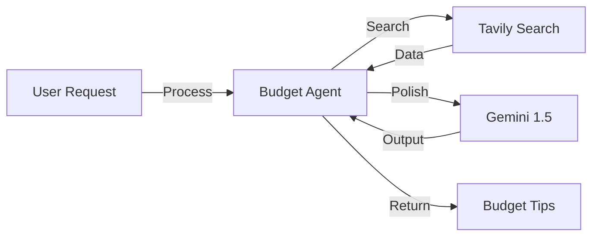
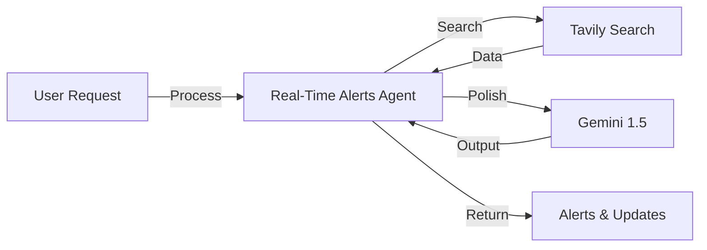
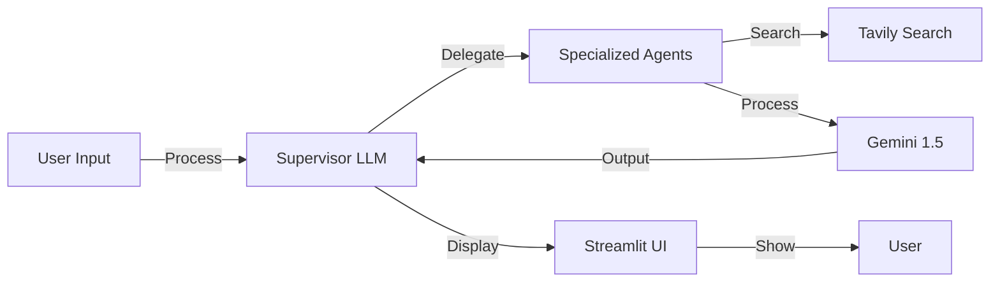

# 🧳 Travel Buddy

> **Your AI-powered travel companion that crafts personalized travel experiences using LangChain, Gemini 1.5 Flash, and Tavily Search.**

## 📋 Table of Contents
- [Overview]
- [Architecture]
- [Project Structure]
- [Tech Stack]
- [Setup & Usage]


## 🌟 Overview

Travel Buddy is a sophisticated multi-agent AI system that creates personalized travel plans by leveraging specialized AI agents working in harmony. Each agent focuses on a specific aspect of travel planning, ensuring comprehensive and detailed travel recommendations.

## 🏗️ Architecture

### Basic Flow


### Multi-Agent Orchestration


### Individual Agent Flows

#### Destination Agent


#### Flight Agent


#### Accommodation Agent


#### Itinerary Agent


#### Local Experience Agent


#### Budget Agent


#### Real-Time Alerts Agent


### Tech Stack Flow


## 📁 Project Structure

```
travel-buddy/
├── agents/
│   ├── destination_agent.py
│   ├── flight_agent.py
│   ├── accommodation_agent.py
│   ├── itinerary_agent.py
│   ├── local_experience_agent.py
│   ├── budget_agent.py
│   └── realtime_adaptation_agent.py
├── orchestrator/
│   └── agent_manager.py
├── tools/
│   ├── tavily_search.py
│   └── llm.py
├── streamlit_app.py
├── requirements.txt
└── README.md
```

## ⚙️ Tech Stack

- **LangChain**: Agent orchestration, memory, and tool integration
- **Gemini 1.5 Flash**: Fast, context-rich LLM for agent reasoning and communication
- **Tavily Search**: Real-time, web-grounded information
- **Streamlit**: Interactive, visually rich UI

## 🚀 Setup & Usage

1. Clone the repository
```bash
git clone https://github.com/srikrishnavansi/travel_buddy.git
cd travel-buddy
```

2. Install dependencies
```bash
pip install -r requirements.txt
```

3. Run the app
```bash
streamlit run streamlit_app.py
```

4. Enter your Tavily and Google Gemini API keys in the sidebar

---

> **Built with ❤️ by leveraging the power of multi-agent AI, LLMs, and real-time data. Enjoy your next adventure!** 
